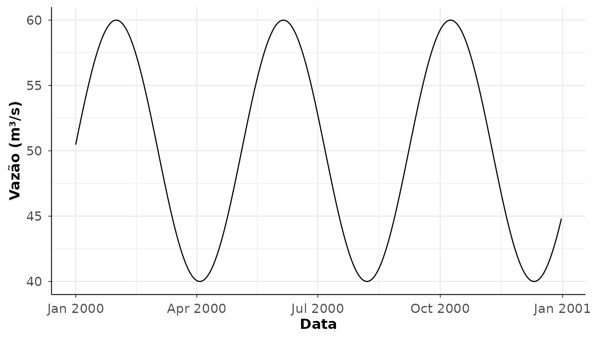

# Introdução ao hydroDataBR

## Introdução

O `hydroDataBR` é um pacote R para obter, padronizar, analisar,
visualizar e exportar dados hidrológicos da Agência Nacional de Águas e
Saneamento Básico (ANA), com foco em séries diárias, produtos
fluviométricos e fluxos de trabalho reprodutíveis.

A API pública é intencionalmente enxuta. A aquisição de dados ANA é
centralizada em
[`get_ana_data()`](https://hydrostat.github.io/hydroDataBR/reference/get_ana_data.md)
e
[`get_ana_data_batch()`](https://hydrostat.github.io/hydroDataBR/reference/get_ana_data_batch.md).
As etapas de análise, gráficos, tabelas e exportação usam funções
fonte-neutras:

``` r

analyze_hydro_data()
plot_hydro_data()
table_hydro_data()
write_hydro_data()
```

## Banco interno ANA

O pacote inclui um retrato estático de dados da ANA obtido em junho de
2026. Esse banco interno é útil para consultas rápidas, exemplos e
diagnósticos offline, mas não substitui os serviços online da ANA.

``` r

library(hydroDataBR)

stations <- filter_ana_stations(
  station_type = "fluviometric"
)

if ("discharge_start_date" %in% names(stations)) {
  stations <- stations[!is.na(stations$discharge_start_date), ]
}

head(stations)
#>  [1] station_code               station_name              
#>  [3] station_type               state_code                
#>  [5] municipality               basin_code                
#>  [7] basin_name                 latitude                  
#>  [9] longitude                  altitude_m                
#> [11] drainage_area_km2          operator                  
#> [13] responsible_agency         is_operating              
#> [15] discharge_start_date       discharge_end_date        
#> [17] telemetric_start_date      telemetric_end_date       
#> [19] stage_start_date           stage_end_date            
#> [21] rainfall_start_date        rainfall_end_date         
#> [23] has_discharge_measurements has_telemetry             
#> [25] has_stage_data             has_rainfall_data         
#> [27] last_update               
#> <0 rows> (or 0-length row.names)
```

Os dados online atuais podem divergir do retrato incluído no pacote.

## Contrato de série diária

As funções de leitura e aquisição convergem para uma estrutura
padronizada de série diária. As colunas principais são:

``` text
station_code
date
variable
value
unit
consistency_level
source_status
source
```

O exemplo abaixo cria uma série diária pequena, apenas para demonstrar o
fluxo de análise, gráfico e tabela sem depender de serviços online.

``` r

daily <- data.frame(
  station_code = "00000000",
  date = seq.Date(as.Date("2000-01-01"), as.Date("2000-12-31"), by = "day"),
  variable = "discharge",
  value = 50 + sin(seq_len(366) / 20) * 10,
  unit = "m3/s",
  consistency_level = 1L,
  source_status = NA_character_,
  source = "example"
)

head(daily)
#>   station_code       date  variable    value unit consistency_level
#> 1     00000000 2000-01-01 discharge 50.49979 m3/s                 1
#> 2     00000000 2000-01-02 discharge 50.99833 m3/s                 1
#> 3     00000000 2000-01-03 discharge 51.49438 m3/s                 1
#> 4     00000000 2000-01-04 discharge 51.98669 m3/s                 1
#> 5     00000000 2000-01-05 discharge 52.47404 m3/s                 1
#> 6     00000000 2000-01-06 discharge 52.95520 m3/s                 1
#>   source_status  source
#> 1          <NA> example
#> 2          <NA> example
#> 3          <NA> example
#> 4          <NA> example
#> 5          <NA> example
#> 6          <NA> example
```

## Análise

``` r

stats <- analyze_hydro_data(daily, analysis = "daily_statistics")
availability <- analyze_hydro_data(daily, analysis = "daily_availability")

stats
#>   station_code  variable unit year period days_expected days_observed
#> 1     00000000 discharge m3/s 2000   2000           366           366
#>   days_with_value days_missing availability_pct missing_pct mean_value
#> 1             366            0              100           0   50.07331
#>   min_value max_value total_value
#> 1   40.0001  59.99992    18326.83
head(availability)
#>   station_code  variable year period days_expected days_observed
#> 1     00000000 discharge 2000   2000           366           366
#>   days_with_value days_missing availability_pct missing_pct
#> 1             366            0              100           0
```

## Gráficos

As funções de gráfico retornam objetos `ggplot`, que podem ser
modificados com camadas usuais do `ggplot2`.

``` r

plot_hydro_data(daily, plot = "daily_series")
```



## Tabelas

``` r

tab <- table_hydro_data(daily, table = "daily_availability")
head(tab)
#>   station_code  variable year period days_expected days_observed
#> 1     00000000 discharge 2000   2000           366           366
#>   days_with_value days_missing availability_pct missing_pct
#> 1             366            0              100           0
```

## Aquisição autenticada

A aquisição autenticada exige credenciais próprias do usuário junto à
ANA. O pacote não armazena, imprime ou registra CPF/CNPJ, senha, tokens
ou cabeçalhos sensíveis.

Exemplos de aquisição autenticada não são executados automaticamente:

``` r

token <- ana_authenticate(
  identifier = Sys.getenv("ANA_HIDROWEBSERVICE_IDENTIFIER"),
  password = Sys.getenv("ANA_HIDROWEBSERVICE_PASSWORD")
)

x <- get_ana_data(
  product = "daily_discharge",
  data_source = "api",
  station_code = "00000000",
  start_date = "2000-01-01",
  end_date = "2000-12-31",
  token = token
)
```

## Próximos passos

Depois de obter ou ler uma série diária, o fluxo recomendado é:

``` r

dados <- get_ana_data(...)
analise <- analyze_hydro_data(dados, analysis = "daily_statistics")
grafico <- plot_hydro_data(dados, plot = "daily_series")
tabela <- table_hydro_data(analise)
write_hydro_data(tabela, path = "resultado.csv")
```
